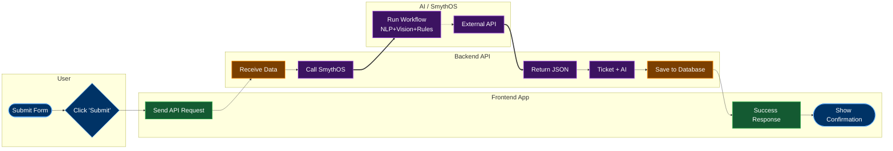

```mermaid
%% Increase font size for readability
%%{ init: { 'themeVariables': { 'fontSize': '24px', 'fontFamily': 'Arial' } } }%%

graph LR

    %% User
    subgraph "User"
        A([Submit Form]) --> B{Click 'Submit'}
    end

    %% Frontend
    subgraph "Frontend App"
        B --> C[Send API Request]
        K[Success Response] --> L([Show Confirmation])
    end

    %% Backend
    subgraph "Backend API"
        C --> D[Receive Data]
        D --> E[Call SmythOS]
        H[AI Analysis Received] --> I[Ticket + AI]
        I --> J[Save to Database]
        J --> K
    end

    %% AI System
    subgraph "AI / SmythOS"
        E ==> F[Run Workflow<br>NLP+Vision+Rules]
        F -.-> G[External API]
        G ==> H[Return JSON]
    end

    %% Styling for dark theme
    style A fill:#003366,stroke:#66B2FF,color:#FFFFFF,stroke-width:2px
    style B fill:#003366,stroke:#66B2FF,color:#FFFFFF,stroke-width:2px
    style L fill:#003366,stroke:#66B2FF,color:#FFFFFF,stroke-width:2px

    style C fill:#145A32,stroke:#28A745,color:#FFFFFF,stroke-width:2px
    style K fill:#145A32,stroke:#28A745,color:#FFFFFF,stroke-width:2px

    style D fill:#7B3F00,stroke:#FF8C00,color:#FFFFFF,stroke-width:2px
    style J fill:#7B3F00,stroke:#FF8C00,color:#FFFFFF,stroke-width:2px

    style E fill:#3C1361,stroke:#9D4EDD,color:#FFFFFF,stroke-width:2px
    style F fill:#3C1361,stroke:#9D4EDD,color:#FFFFFF,stroke-width:2px
    style G fill:#3C1361,stroke:#9D4EDD,color:#FFFFFF,stroke-width:2px
    style H fill:#3C1361,stroke:#9D4EDD,color:#FFFFFF,stroke-width:2px
    style I fill:#3C1361,stroke:#9D4EDD,color:#FFFFFF,stroke-width:2px
```
