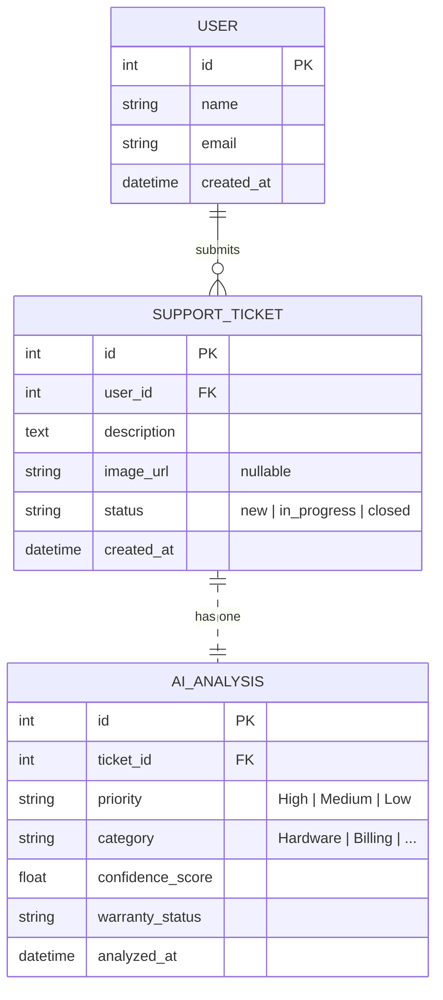

```mermaid
erDiagram
    USER ||--o{ SUPPORT_TICKET : "submits"
    SUPPORT_TICKET ||..|| AI_ANALYSIS : "has one"

    USER {
        int id PK
        string name
        string email
        datetime created_at
    }

    SUPPORT_TICKET {
        int id PK
        int user_id FK
        text description
        string image_url "nullable"
        string status "new | in_progress | closed"
        datetime created_at
    }

    AI_ANALYSIS {
        int id PK
        int ticket_id FK
        string priority "High | Medium | Low"
        string category "Hardware | Billing | ..."
        float confidence_score
        string warranty_status
        datetime analyzed_at
    }
```